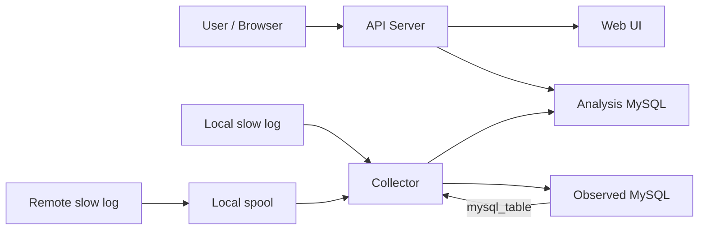
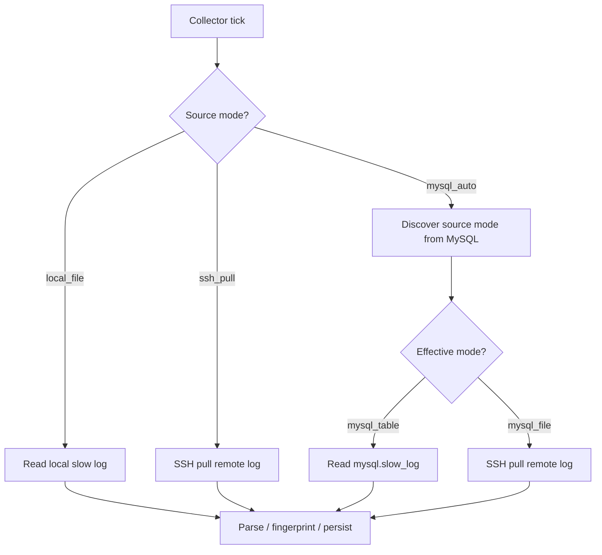

# Slow SQL Observer

Slow SQL Observer is a single-source MySQL slow-SQL collection and analysis tool written in Go. It reads slow-query events from a slow log file or from `mysql.slow_log`, fingerprints repeated SQL, stores raw records and aggregates in a dedicated analysis schema, and exposes both an HTTP API and a lightweight web UI.

For the Chinese guide, see [README.zh-CN.md](README.zh-CN.md).

## Project status

The project is considered complete as a general-purpose single-source release for environments where slow-query data is reachable through one of these paths:

- a locally readable slow log file
- a remote slow log file that can be pulled through SSH
- `mysql.slow_log` when the source instance exposes slow logs through `log_output=TABLE`

The project is not positioned as a universal managed-cloud slow-log collector. In particular, a hosted MySQL instance that uses `log_output=FILE` but does not expose SSH or another provider log API is out of scope for this release.

## What It Does

- collects slow-query events from one observed MySQL source
- normalizes SQL into fingerprints
- stores raw records and aggregate stats in a separate analysis schema
- serves a web UI for overview, fingerprint list, detail, and raw record drill-down
- exposes runtime status for source info, collector status, acquisition status, and discovery status

## Architecture

Detailed diagrams live in [docs/architecture.md](docs/architecture.md). The core runtime shape is:



Collector flow:



## Runtime model

This release is intentionally single-source:

- one observed MySQL source
- one analysis MySQL schema owned by Slow SQL Observer
- one collector process
- one API/web process

Supported source modes:

- `local_file`
  Read a locally accessible slow log directly.
- `ssh_pull`
  Pull a remote Linux/OpenSSH slow log into a local spool file, then parse the spool.
- `mysql_auto`
  Connect to the source MySQL, inspect slow-log configuration, and choose:
  - `mysql_table` when `log_output=TABLE`
  - `mysql_file` when `log_output=FILE` or `FILE,TABLE`

Important `mysql_auto` note:

- if the effective mode is `mysql_table`, the collector reads `mysql.slow_log`
- if the effective mode is `mysql_file`, the collector still needs file access, which currently means SSH settings must be available

## Support matrix

Supported:

- local MySQL with `log_output=FILE`
- local MySQL with `log_output=TABLE`
- self-managed remote MySQL where the slow log can be read through SSH
- one MySQL instance that contains multiple business databases

Not supported in this release:

- multiple observed sources in one runtime
- hosted MySQL where `log_output=FILE` is enabled but no SSH or provider log API is available
- password-based SSH auth
- remote Windows hosts for `ssh_pull`
- archived rotated slow-log backfill

## Configuration

Copy the template first:

```powershell
Copy-Item .env.example .env
```

Core settings:

- `SSO_SERVER_ADDR`
- `SSO_WEB_DIR`
- `SSO_SOURCE_INSTANCE_NAME`
- `SSO_SOURCE_MODE`
- `SSO_SOURCE_DB_DSN`
- `SSO_SOURCE_TIMEZONE`
- `SSO_SOURCE_DESCRIPTION`
- `SSO_ANALYSIS_DB_DSN`
- `SSO_ANALYSIS_DB_SCHEMA`
- `SSO_COLLECTOR_POLL_INTERVAL`
- `SSO_RAW_RECORD_RETENTION_DAYS`
- `SSO_ANALYSIS_MIN_QUERY_TIME_SEC`
- `SSO_LOG_LEVEL`

Mode-specific settings:

- `local_file`
  - `SSO_SOURCE_SLOW_LOG_PATH`
- `ssh_pull`
  - `SSO_SOURCE_REMOTE_HOST`
  - `SSO_SOURCE_REMOTE_PORT`
  - `SSO_SOURCE_REMOTE_USER`
  - `SSO_SOURCE_REMOTE_SLOW_LOG_PATH`
  - `SSO_SOURCE_SSH_PRIVATE_KEY_PATH`
  - `SSO_SOURCE_SSH_KNOWN_HOSTS_PATH`
  - `SSO_SOURCE_LOCAL_SPOOL_DIR`
  - `SSO_SOURCE_INITIAL_POSITION`
  - `SSO_SOURCE_LOCAL_SPOOL_MAX_BYTES`
- `mysql_auto`
  - `SSO_SOURCE_DB_DSN` is required
  - if discovery resolves to `mysql_file`, the SSH settings above are still required unless the file is otherwise reachable

Legacy compatibility:

- `SSO_INSTANCE_NAME`
- `SSO_SLOW_LOG_PATH`
- `SSO_DB_DSN`
- `SSO_DB_SCHEMA`
- `SSO_SOURCE_LOG_MODE`

When both legacy and current names are present, the current names win.

## Collection threshold vs analysis threshold

Slow SQL Observer now treats these as two separate concepts:

- MySQL collection threshold
  Usually controlled by MySQL settings such as `slow_query_log` and `long_query_time`.
  This decides which statements enter the slow-log source at all.
- Slow SQL Observer analysis threshold
  Controlled by `SSO_ANALYSIS_MIN_QUERY_TIME_SEC`.
  This decides which collected records appear in the default overview and ranking views.

Example:

- MySQL can collect at `0.2s` so you keep more raw samples.
- Slow SQL Observer can analyze by default at `1.0s` so the main UI stays focused on materially slow statements.
- API and UI requests can override the default with `minQueryTimeSec`.

## Quick start

### Option A: sample log

Use the bundled sample file for a zero-dependency smoke test:

```env
SSO_SOURCE_MODE=local_file
SSO_SOURCE_SLOW_LOG_PATH=./scripts/sample-slow.log
SSO_ANALYSIS_DB_DSN=root:root@tcp(127.0.0.1:3306)/
SSO_ANALYSIS_DB_SCHEMA=slow_sql_observer
```

### Option B: local MySQL slow log

Recommended for real validation on a local MySQL instance:

1. Enable slow query logging in MySQL.
2. Point `SSO_SOURCE_MODE=local_file`.
3. Set `SSO_SOURCE_SLOW_LOG_PATH` to the full slow-log file path.
4. Point `SSO_SOURCE_DB_DSN` at the same local MySQL instance if you want source metadata.
5. Optionally set `SSO_ANALYSIS_MIN_QUERY_TIME_SEC=1` so the default ranking views focus on queries at or above 1 second.

Windows note:

If MySQL writes slow logs under `C:\ProgramData\MySQL\...`, the collector may need to run from an elevated PowerShell window in order to read the file.

## Start the application

Start the API server:

```powershell
go run ./cmd/server
```

Start the collector in another terminal:

```powershell
go run ./cmd/collector
```

Then open the address that matches `SSO_SERVER_ADDR`.

Examples:

- if `SSO_SERVER_ADDR=:8080`, open [http://localhost:8080](http://localhost:8080)
- if `SSO_SERVER_ADDR=:8191`, open [http://localhost:8191](http://localhost:8191)

If your local Go build cache path is permission-restricted, set a repo-local cache first:

```powershell
if (-not (Test-Path .gocache)) { New-Item -ItemType Directory -Path .gocache | Out-Null }
$env:GOCACHE = (Resolve-Path .gocache).Path
```

## Local validation workflow

The repository includes a demo business-database script for local end-to-end testing:

- [scripts/create-observed-demo-db.sql](scripts/create-observed-demo-db.sql)

Suggested validation flow:

1. Create the demo business schema:

   ```powershell
   mysql -uroot -p < scripts/create-observed-demo-db.sql
   ```

2. Lower the slow-log threshold in MySQL for testing:

   ```sql
   SET GLOBAL slow_query_log = 'ON';
   SET GLOBAL long_query_time = 0.2;
   SET GLOBAL log_queries_not_using_indexes = 'ON';
   ```

3. Start `server` and `collector`.

4. Run one of the demo workload queries against `sso_demo_app`.

5. Verify data in:
   - `/api/dashboard/overview`
   - `/api/slow-sql/fingerprints`
   - `/api/slow-sql/fingerprints/:id/records`
   - optionally compare `/api/slow-sql/fingerprints?minQueryTimeSec=0.2` and `/api/slow-sql/fingerprints?minQueryTimeSec=1`

This has been verified locally against a real MySQL slow-log file.

## Release close-out

This release is a usable single-source edition and is suitable for:

- local MySQL slow-log collection from a readable file
- local or reachable MySQL slow-log collection from `mysql.slow_log`
- one observed MySQL instance that may contain multiple business databases

This release does not attempt to solve every hosted-MySQL slow-log scenario. The main unsupported case is a managed instance that only writes slow logs to `FILE` but does not expose SSH or a provider-side log API.

## How to think about database scope

Slow SQL Observer watches one MySQL instance, not one application schema.

That means:

- if you create a new business database on the same observed MySQL instance, its slow SQL can be collected without changing the project
- the collected records carry `dbName`, so you can filter by business schema later
- if the new business database lives on another MySQL instance, that is a different source and requires a different runtime configuration

## Retention

`SSO_RAW_RECORD_RETENTION_DAYS` controls cleanup of `slow_query_records`:

- `0` or a negative value disables cleanup
- a positive value deletes raw records older than the configured number of days
- fingerprint aggregates are retained

Retention runs inside the collector loop. A retention failure degrades collector status, but already committed ingest data is kept.

## API overview

Current HTTP routes:

- `GET /api/source`
- `GET /api/collector/status`
- `GET /api/acquisition/status`
- `GET /api/discovery/status`
- `GET /api/dashboard/overview`
- `GET /api/slow-sql/fingerprints`
- `GET /api/slow-sql/fingerprints/:id`
- `GET /api/slow-sql/fingerprints/:id/records`

Threshold-aware examples:

- `GET /api/dashboard/overview?minQueryTimeSec=1`
- `GET /api/slow-sql/fingerprints?minQueryTimeSec=1`
- `GET /api/slow-sql/fingerprints/:id?minQueryTimeSec=1`
- `GET /api/slow-sql/fingerprints/:id/records?minQueryTimeSec=1`

Detailed field-level API documentation:

- [docs/api-reference.md](docs/api-reference.md)

## Known limitations

- single-source only
- no built-in cloud-provider slow-log acquisition for FILE-only hosted MySQL
- `mysql_auto` falls back to file acquisition when discovery returns `FILE` or `FILE,TABLE`
- no SQL parser-based fingerprinting yet; the current release uses rule-based normalization

## OpenSpec

Archived work:

- `openspec/changes/archive/2026-06-09-build-v1-slow-log-pipeline/`
- `openspec/changes/archive/2026-06-09-add-source-aware-v2/`

Applied and completed work in the current codebase includes the source-aware and acquisition layers discussed in later OpenSpec changes, even though not every explored direction is intended to ship as a broader product promise.
