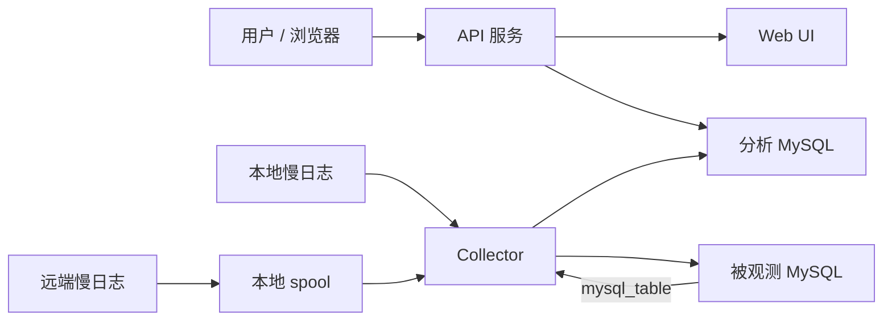
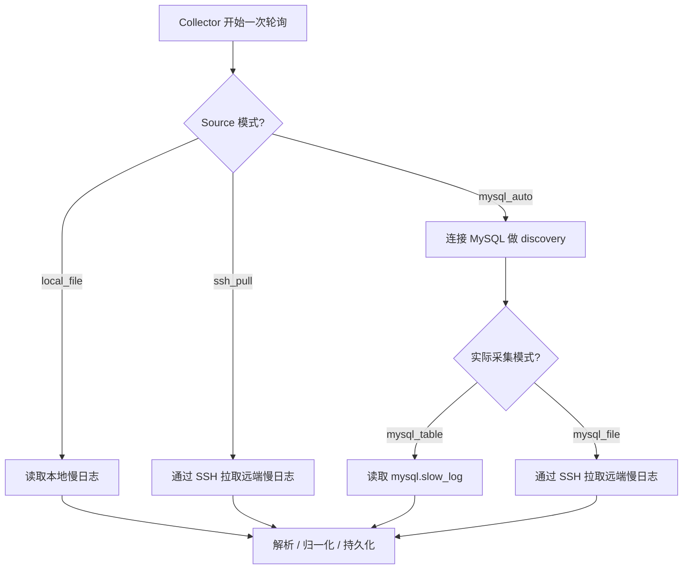

# Slow SQL Observer

Slow SQL Observer 是一个基于 Go 的单 source MySQL 慢 SQL 采集与分析工具。它可以从慢日志文件或 `mysql.slow_log` 表读取慢查询事件，对重复 SQL 做 fingerprint 归一化，把原始记录和聚合结果写入独立的分析库，并提供 HTTP API 和轻量 Web UI。

英文说明见 [README.md](README.md)。

## 项目当前定位

这个版本已经按“通用单 source 版本”收官，适合以下环境：

- 本地可直接读取的 MySQL 慢日志文件
- 可通过 SSH 拉取的远端慢日志文件
- 通过 `log_output=TABLE` 暴露 `mysql.slow_log` 的 MySQL 实例

这个版本不追求覆盖所有托管云数据库慢日志场景。尤其是下面这类环境，不在当前版本承诺范围内：

- 托管云 MySQL
- `log_output=FILE`
- 没有 SSH
- 也没有额外的云厂商日志获取 API

## 它做了什么

- 采集一个被观测 MySQL source 的慢查询事件
- 对 SQL 做归一化和 fingerprint 聚合
- 将原始记录和聚合指标写入独立分析库
- 提供总览、fingerprint 列表、详情、原始记录下钻页面
- 提供 source、collector、acquisition、discovery 等运行状态接口

## 架构图

更完整的图见 [docs/architecture.md](docs/architecture.md)。GitHub 会直接渲染下面这些 Mermaid 图。



采集流程图：



## 运行模型

当前版本明确是单 source 模型：

- 一个被观测 MySQL source
- 一个由 Slow SQL Observer 自己维护的分析库 schema
- 一个 collector 进程
- 一个 API/Web 进程

支持的 source 模式：

- `local_file`
  直接解析本地可读的慢日志文件。
- `ssh_pull`
  通过 SSH 从远端 Linux/OpenSSH 主机拉取慢日志到本地 spool 文件，再解析 spool。
- `mysql_auto`
  先连接 source MySQL，检查慢日志配置，再决定走：
  - `mysql_table`：当 `log_output=TABLE`
  - `mysql_file`：当 `log_output=FILE` 或 `FILE,TABLE`

`mysql_auto` 的一个重要边界：

- 如果发现结果是 `mysql_table`，collector 会直接读取 `mysql.slow_log`
- 如果发现结果是 `mysql_file`，当前版本仍然需要文件访问能力，通常意味着还需要 SSH 相关配置

## 支持范围

当前支持：

- 本地 MySQL 且慢日志输出到文件
- 本地 MySQL 且慢日志输出到表
- 自建远端 MySQL，且可通过 SSH 读取慢日志文件
- 一个 MySQL 实例下包含多个业务库的场景

当前不支持：

- 一个运行实例同时监控多个 source
- 托管云 MySQL 在 `FILE` 模式下但没有 SSH 或云厂商日志 API 的场景
- `ssh_pull` 的密码登录
- `ssh_pull` 的远端 Windows 主机
- 已轮转归档的历史慢日志自动回补

## 配置说明

先复制模板：

```powershell
Copy-Item .env.example .env
```

核心配置：

- `SSO_SERVER_ADDR`
- `SSO_WEB_DIR`
- `SSO_SOURCE_INSTANCE_NAME`
- `SSO_SOURCE_MODE`
- `SSO_SOURCE_DB_DSN`
- `SSO_SOURCE_TIMEZONE`
- `SSO_SOURCE_DESCRIPTION`
- `SSO_ANALYSIS_DB_DSN`
- `SSO_ANALYSIS_DB_SCHEMA`
- `SSO_COLLECTOR_POLL_INTERVAL`
- `SSO_RAW_RECORD_RETENTION_DAYS`
- `SSO_LOG_LEVEL`

按模式补充的配置：

- `local_file`
  - `SSO_SOURCE_SLOW_LOG_PATH`
- `ssh_pull`
  - `SSO_SOURCE_REMOTE_HOST`
  - `SSO_SOURCE_REMOTE_PORT`
  - `SSO_SOURCE_REMOTE_USER`
  - `SSO_SOURCE_REMOTE_SLOW_LOG_PATH`
  - `SSO_SOURCE_SSH_PRIVATE_KEY_PATH`
  - `SSO_SOURCE_SSH_KNOWN_HOSTS_PATH`
  - `SSO_SOURCE_LOCAL_SPOOL_DIR`
  - `SSO_SOURCE_INITIAL_POSITION`
  - `SSO_SOURCE_LOCAL_SPOOL_MAX_BYTES`
- `mysql_auto`
  - `SSO_SOURCE_DB_DSN` 必填
  - 如果 discovery 最终落到 `mysql_file`，上面的 SSH 配置仍然需要补齐

兼容旧变量：

- `SSO_INSTANCE_NAME`
- `SSO_SLOW_LOG_PATH`
- `SSO_DB_DSN`
- `SSO_DB_SCHEMA`
- `SSO_SOURCE_LOG_MODE`

如果新旧变量同时存在，以当前变量名为准。

## 快速开始

### 方案 A：使用示例日志

如果只是先 smoke test，可以直接使用仓库里的示例日志：

```env
SSO_SOURCE_MODE=local_file
SSO_SOURCE_SLOW_LOG_PATH=./scripts/sample-slow.log
SSO_ANALYSIS_DB_DSN=root:root@tcp(127.0.0.1:3306)/
SSO_ANALYSIS_DB_SCHEMA=slow_sql_observer
```

### 方案 B：使用本地 MySQL 慢日志

这也是当前最推荐的真实验证方式：

1. 在本地 MySQL 中开启慢日志。
2. 设置 `SSO_SOURCE_MODE=local_file`。
3. 把 `SSO_SOURCE_SLOW_LOG_PATH` 指向完整的慢日志文件路径。
4. 如果你希望页面展示 source 元数据，可以把 `SSO_SOURCE_DB_DSN` 指向同一个本地 MySQL。

Windows 提示：

如果你的 MySQL 慢日志位于 `C:\ProgramData\MySQL\...`，collector 可能需要在“管理员 PowerShell”里启动，否则会遇到文件读取权限问题。

## 启动方式

启动 API 服务：

```powershell
go run ./cmd/server
```

在另一个终端启动 collector：

```powershell
go run ./cmd/collector
```

然后打开：

- [http://localhost:8080](http://localhost:8080)

如果本机 Go 默认缓存目录权限有问题，可以先把缓存切到仓库内：

```powershell
if (-not (Test-Path .gocache)) { New-Item -ItemType Directory -Path .gocache | Out-Null }
$env:GOCACHE = (Resolve-Path .gocache).Path
```

## 本地验证流程

仓库里已经提供了一份本地业务库模拟脚本：

- [scripts/create-observed-demo-db.sql](scripts/create-observed-demo-db.sql)

建议按这个流程验证：

1. 创建一个模拟业务库：

   ```powershell
   mysql -uroot -p < scripts/create-observed-demo-db.sql
   ```

2. 在 MySQL 中调低慢日志阈值，方便测试：

   ```sql
   SET GLOBAL slow_query_log = 'ON';
   SET GLOBAL long_query_time = 0.2;
   SET GLOBAL log_queries_not_using_indexes = 'ON';
   ```

3. 启动 `server` 和 `collector`。

4. 对 `sso_demo_app` 执行脚本末尾提供的慢查询示例。

5. 到下面这些接口或页面确认是否已经采到数据：
   - `/api/dashboard/overview`
   - `/api/slow-sql/fingerprints`
   - `/api/slow-sql/fingerprints/:id/records`

这条本地慢日志采集链路已经用真实 MySQL 文件完成过验证。

## 怎样理解“监听哪个数据库”

Slow SQL Observer 监听的是一个 MySQL 实例，不是单独某个业务库。

这意味着：

- 如果你在同一个被观测 MySQL 实例上新建了业务库，不需要改项目配置
- 只要这个新库产生了慢 SQL，并且 MySQL 把它写进慢日志，项目就能采到
- 采集后的记录会带 `dbName`，后续可以按业务库维度过滤
- 如果新业务库在另一台 MySQL 实例上，那就是另一个 source，需要单独配置

## 原始记录保留策略

`SSO_RAW_RECORD_RETENTION_DAYS` 用来控制 `slow_query_records` 的保留天数：

- `0` 或负数表示关闭自动清理
- 正数表示删除早于该天数的原始慢 SQL 记录
- fingerprint 聚合结果会继续保留

清理动作在 collector 轮询中顺带执行。清理失败会让 collector 状态进入 degraded，但不会回滚已经成功提交的采集结果。

## API 概览

当前提供的接口：

- `GET /api/source`
- `GET /api/collector/status`
- `GET /api/acquisition/status`
- `GET /api/discovery/status`
- `GET /api/dashboard/overview`
- `GET /api/slow-sql/fingerprints`
- `GET /api/slow-sql/fingerprints/:id`
- `GET /api/slow-sql/fingerprints/:id/records`

更详细的字段级接口说明见：

- [docs/api-reference.md](docs/api-reference.md)

## 已知限制

- 当前只支持单 source
- 暂不支持托管云 MySQL 的 FILE-only 慢日志自动获取
- `mysql_auto` 在发现结果为 `FILE` 或 `FILE,TABLE` 时，当前仍会回到文件采集链路
- 当前 fingerprint 仍然是规则归一化方案，不是完整 SQL parser 方案

## OpenSpec

已归档的变更：

- `openspec/changes/archive/2026-06-09-build-v1-slow-log-pipeline/`
- `openspec/changes/archive/2026-06-09-add-source-aware-v2/`

当前代码已经包含 source-aware 与 acquisition 层的主要实现结果，但并不代表之前讨论过的每条探索方向都已经进入正式产品承诺范围。
