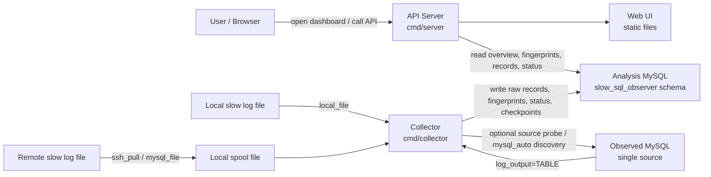
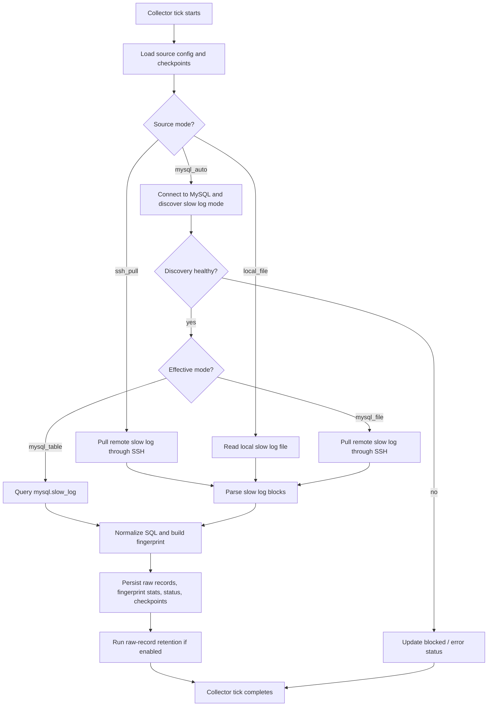
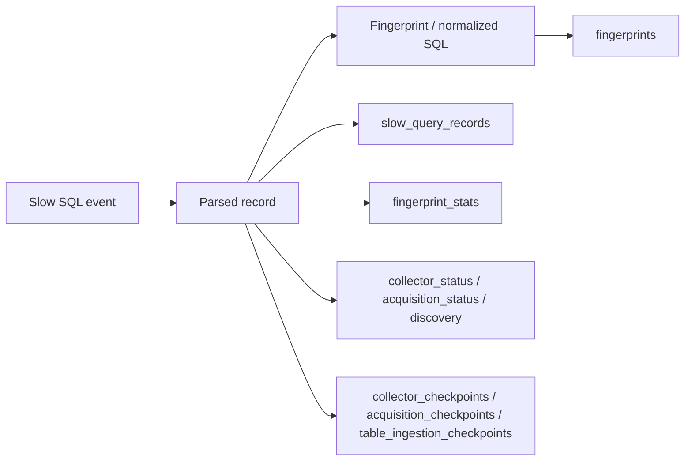

# Architecture

This document captures the runtime architecture and the collector flow of Slow SQL Observer in a GitHub-friendly Mermaid format.

## System architecture

## Collector decision flow

## Data model flow

## Scope notes

- The current release is single-source by design.
- The collector watches one MySQL instance, not one individual business schema.
- A new business database created on the same observed MySQL instance is included automatically as long as its slow SQL enters the slow-log source.
- Hosted MySQL with `log_output=FILE` but without SSH or a provider log API is outside the supported scope of this release.
